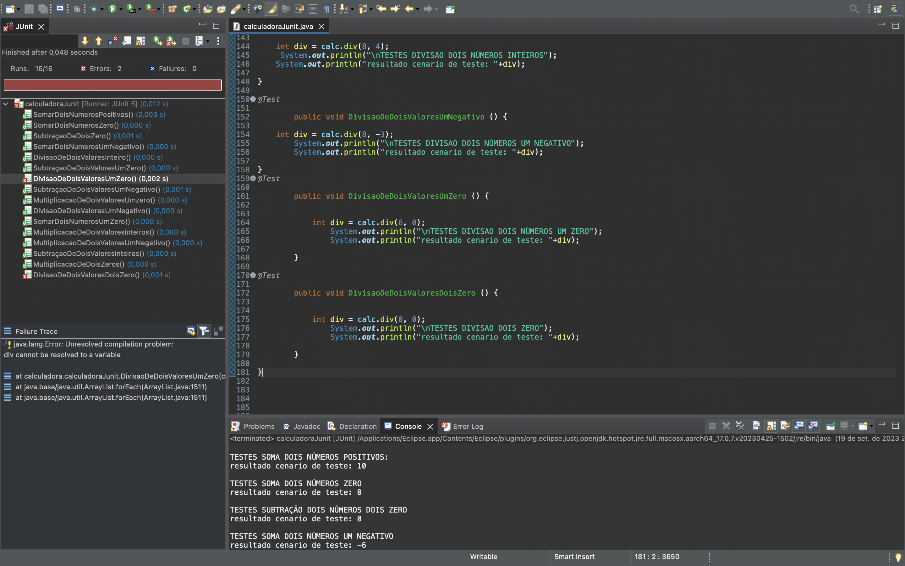

# Calculadora JUNIT

## Descrição
O Projeto foi desenvolvido para solucionar calculos básicos, e testes para o aperfeiçoamento do sistema foram realizado através da junit

## Funcionamento
Os testes foram realizados através da biblioteca Junit onde valores são inseridos atraves de duas variaveis do tipo interia A e B, que com isso é realizado o calculo escolhido pelo usuario atraves da classes das operacões (soma = SOMAR, sub = SUBTRAÇÃO, multi = MULTIPLICAÇÃO, div = DIVISÃO)

## Publicação
[https://github.com/antoniocCarvalho/CalculadoraTQS]

## Última atualização 20/09/23
